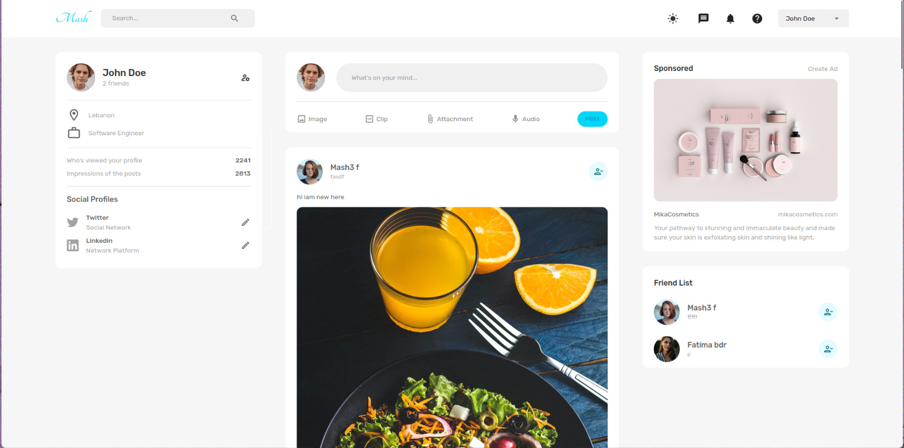
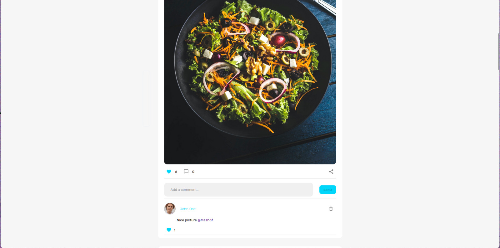
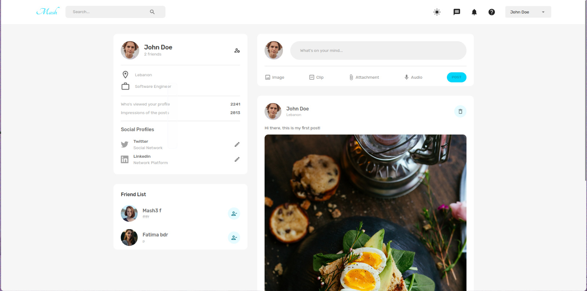
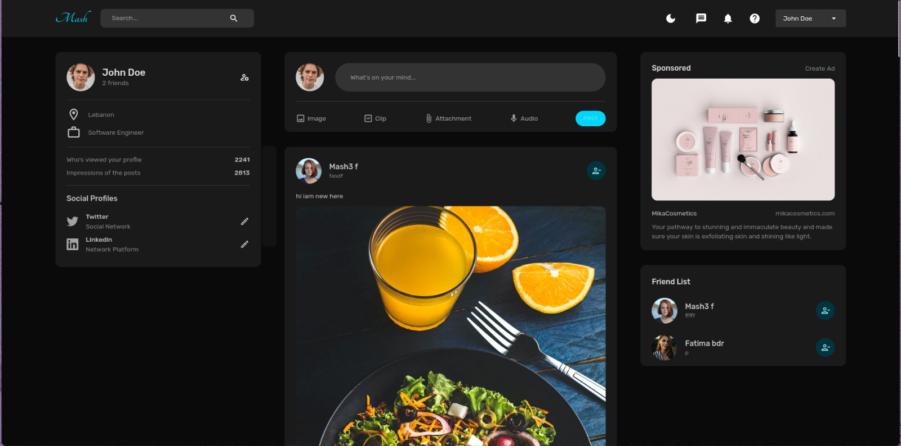

# MERN-SocialMediaWebApp
A full social media web application using MERN stack (reactjs, nodejs, expressjs, mongodb)

. Run npm install in client and server folder.

. Run npm run in both folders too.

